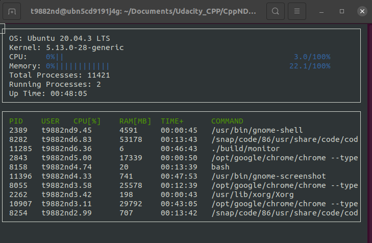

# CppND-System-Monitor

This repo contains the code for the 'System Monitor' project which is a part of the Udacity C++ Nanodegree.

The project code in this repository is based off of the starter code provided in this github repository: [CppND-System-Monitor](https://github.com/udacity/CppND-System-Monitor)

## ncurses
[ncurses](https://www.gnu.org/software/ncurses/) is a library that facilitates text-based graphical output in the terminal. This project relies on ncurses for display output.

For installing ncurses within your own Linux environment: `sudo apt install libncurses5-dev libncursesw5-dev`

## Make
This project uses [Make](https://www.gnu.org/software/make/). The Makefile has four targets:
* `build` compiles the source code and generates an executable
* `format` applies [ClangFormat](https://clang.llvm.org/docs/ClangFormat.html) to style the source code
* `debug` compiles the source code and generates an executable, including debugging symbols
* `clean` deletes the `build/` directory, including all of the build artifacts